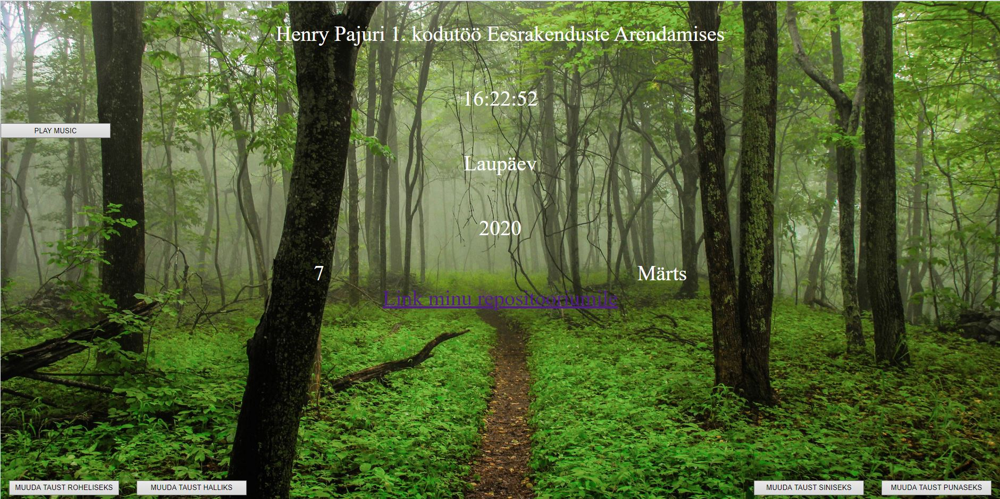

Mina olen Henry Pajuri ja ma tegin lauakella rakenduse. Rakendus näitab kella, kuupäeva, päeva ja aastat. Kellast hiirega kinni võttes on võimalik kella lohistada soovitud kohta. All äärtes on 4 erinevat tausta tooni muutmise nuppu ning vasakul küljel asuvale nupule vajutades hakkab lühike muusikaklipp mängima. Keskel asub link minu repositooriumile.
