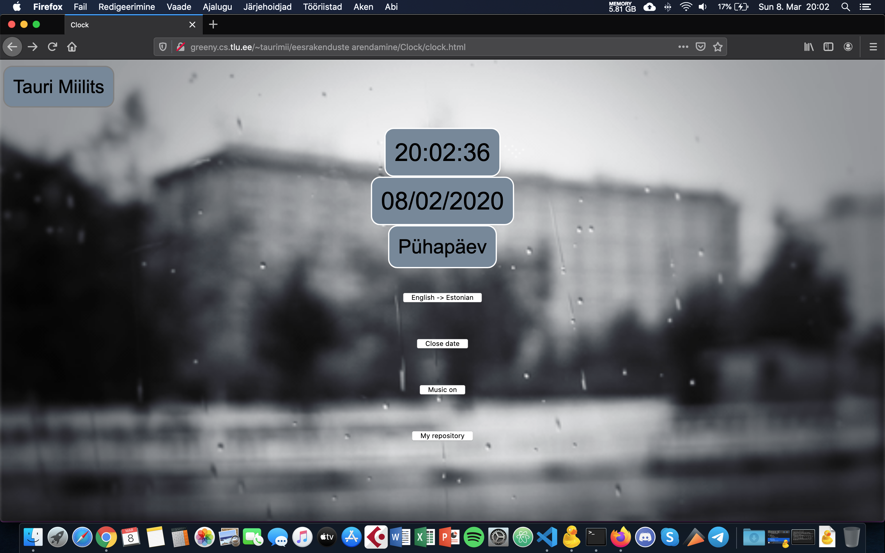

Autor: Tauri Miilits  
Kella funktsionaalsus: kellal saab vahetada keelt inglise või eesti keelseks; saab vaadata kuupäeva ja nädalapäeva ning neid soovi korral niiöelda ära peita; saab panna muusika mängima, mille käigus muutub kogu kella temaatika.  
