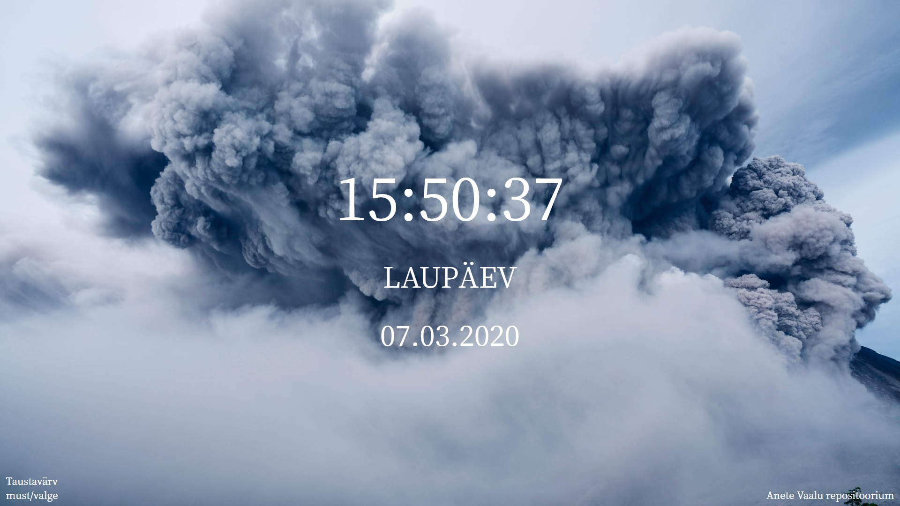

Funktsionaalsus: Sidebar avaneb ülevalt vasakult, nupp muuda värvi muudab kella, kuupäeva ja nädalapäeva värvi. Nupuga muuda taust saab taustapilti vahetada. Klikkides nädalapäeva peale saab seda muuta inglise keelseks.

Autor: Sandra Maidla

Link: http://www.tlu.ee/~ss22nnuu/eesrakendused/hw1/hw1.html
