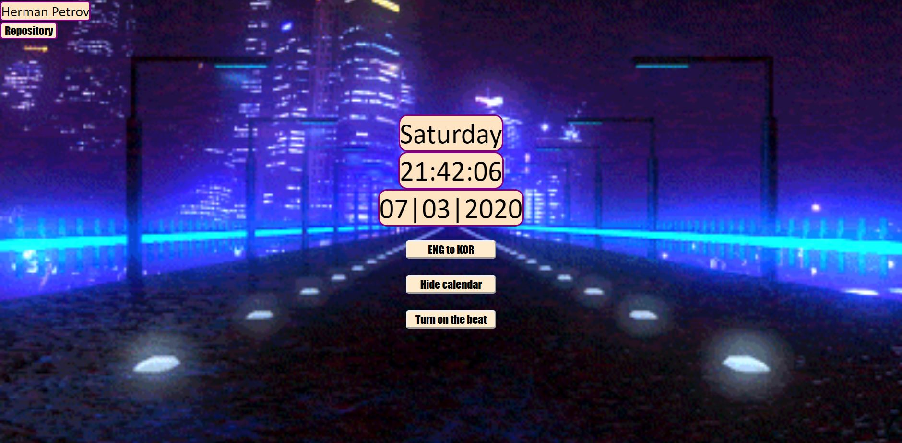
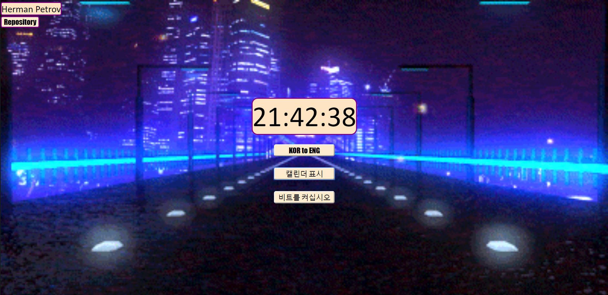
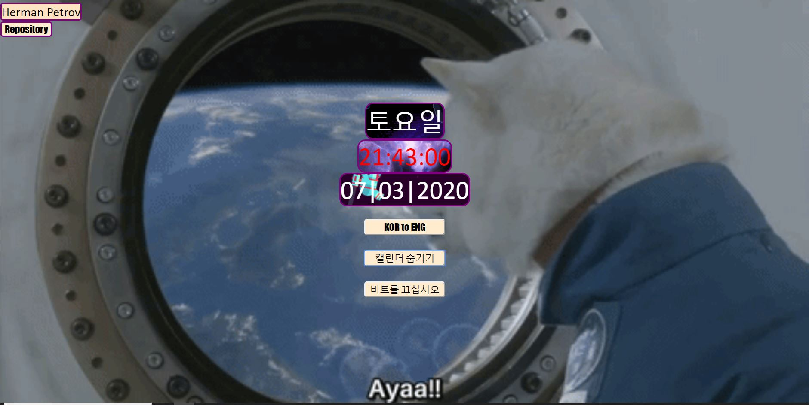

Herman Petrov- kodutoo_1

Olen loonud kella veebilehe funktsioonidega järjekorras:

1.Nädalapäev.
2.Kell : tunnid/minutid/sekundid.
3.Kuupäev päev, kuu, aasta.

Lisasain kella funktsioone kasutades eventListeneri ja function järjekorras:

1.Keele vahetaja mis vahetab lehekülje keelt. English -> Korean.

2.Võimalus peita mitte vajalikud nädalapäeva ja kuupäeva funktsioon.

3.Võimalus vahetada kasutajal tausta ja alustada muusikat.

Kasutatud materjal : 
Jqueryst võetud script css töötlemiseks javascripti failides.
    
                crossorigin="anonymous">
    </script>
    
 Lehe vasakus ülemises nurgas on kirjas looja nimi lisatud link repositooriumile.
 
 
