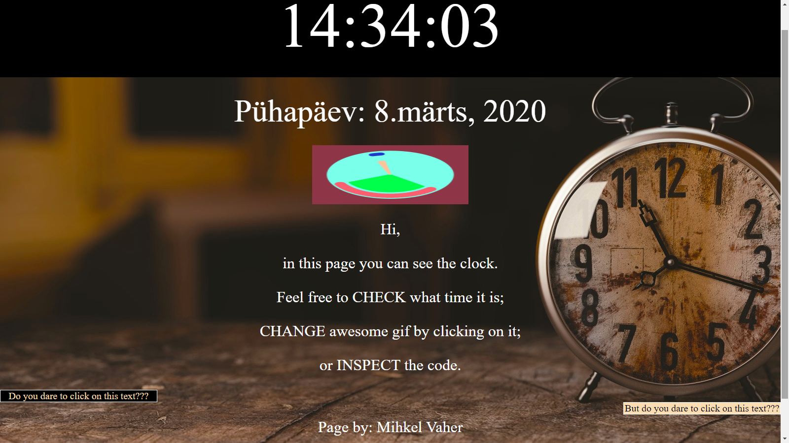

# 1kodutoo
1. kodutöö Eesrakenduste arendamises.

# MIHKEL VAHER

Funktsionaalsused: 
* Kella peale klikkides värv muutub
* GIFi peale klikkides GIF muutub
* Vasakpoolse nupu peale vajutades käivitub iga sekundi tagant teksti taustavärvi vahetus
* Parempoolse nupu peale vajutades käivitub iga sekundi tagant tekstivärvi vahetus

## Olemas:

1. Veebirakendus töötab. Näitab kella, kuupäeva, nädalapäeva ja aastat.
1. Vastavalt kasutaja tegevusele on võimalik muuta **kolme** lauakella atribuuti muuta.
1. Kasutatud on eventListener'e ja funktsioone.
1. Kell on originaalne ning kasutajaliides on maitsekalt kujundatud kasutades CSS-i - peab olema ise kirjutatud. 
1. Autori ees- ja perenimi on lehel välja toodud
1. Lehel on viide rakenduse repositooriumile
1. `README.md` failis on välja toodud autori nimi, ekraanipilt rakendusest ja kirjeldatud funktsionaalsus

