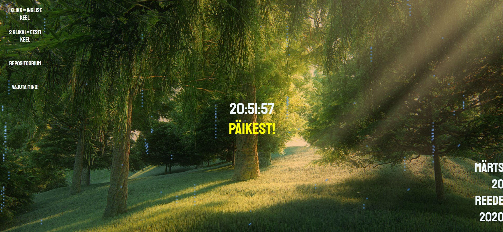

##Filip Taik

Lehte avades hakkavad mängima vihmahääled ja gif vihmapiiskadega katub üle ekraani. Vajutades nupule "Päikest", lähevad vihmahääled ja gif ära. Ilmub nupp "Vihma" millele vajutades tulevad vihmahääled ja gif tagasi ja nupp "Vihma" kaob. Lehe vasakul ääres saab muuta kõik lehel olevad nupud inglise keelseks ja tagasi eesti keelseks.
Kui vajutada nuppu "Vajuta mind", hakkavad kellaosad värvi muutma. Kui hiirega nupu peale tagasi minna siis animatsioon lõpeb.